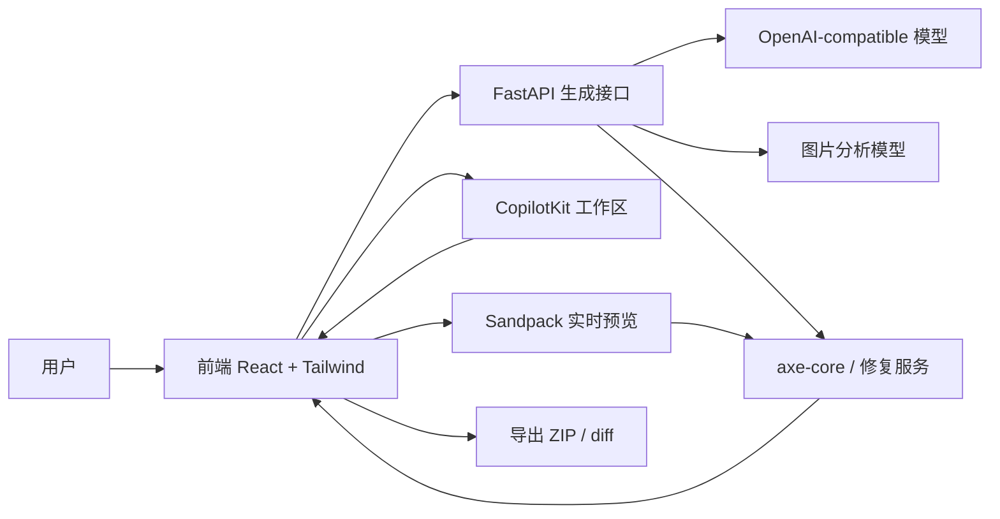

# 系统架构

## 模块划分

- 输入模块：文本描述、图片上传、示例 prompt
- 生成模块：prompt 构建、代码生成、兜底模板
- 预览模块：Sandpack 实时渲染、代码查看、上一版回退
- 协作模块：CopilotKit 工作区助手、迭代修改
- 无障碍模块：axe 扫描、解释、自动修复
- 导出模块：单文件、项目 ZIP、diff

## 设计原则

- 默认中文界面
- 生成结果必须可预览
- 失败时优先回退到稳定版本
- 保持单文件预览环境下的可交付性
